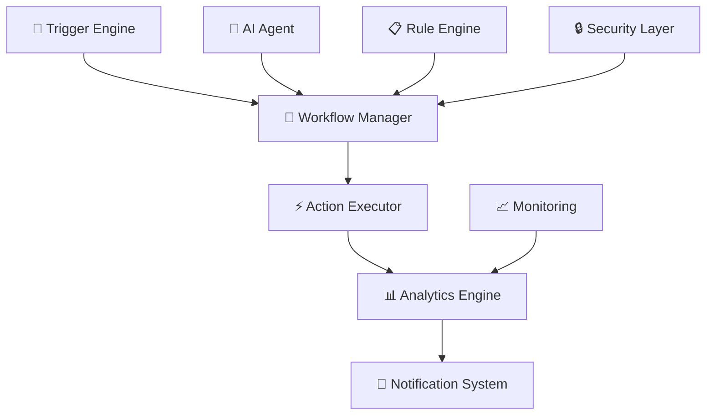

# ⚡ نظام الأتمتة - QnA Automation Engine

<div align="center">


**محرك أتمتة ذكي لسير العمل والعمليات المتقدمة**

[🚀 البدء السريع](#-البدء-السريع) | [📖 التوثيق](#-التوثيق-التفصيلي) | [🔧 API](#-واجهة-برمجة-التطبيقات) | [🎯 أمثلة](#-أمثلة-عملية)

</div>

---

## 🌟 نظرة عامة

**نظام الأتمتة QnA** هو محرك ذكي متطور لأتمتة سير العمل والعمليات، مصمم لتحسين الكفاءة وتقليل التدخل اليدوي. يدمج النظام الذكاء الاصطناعي مع واجهات سهلة الاستخدام لتوفير حلول أتمتة شاملة.

### ✨ المميزات الأساسية

- 🧠 **ذكاء اصطناعي متقدم** - تعلم آلي وتحليل ذكي
- ⚡ **أداء فائق السرعة** - معالجة في الوقت الفعلي
- 🔄 **سير عمل مرن** - قابل للتخصيص والتوسع
- 📊 **تحليلات شاملة** - مراقبة ومتابعة مستمرة
- 🛡️ **أمان متقدم** - حماية البيانات والعمليات
- 🌐 **دعم متعدد اللغات** - عربي وإنجليزي
- 📱 **واجهة متجاوبة** - إدارة من أي جهاز

---

## 🏗️ البنية المعمارية

### 🧠 مكونات النظام الأساسية



### 🏛️ طبقات النظام

| الطبقة | الوصف | المسؤوليات |
|--------|--------|-------------|
| **📱 Interface Layer** | واجهة المستخدم | إدارة سير العمل، المراقبة |
| **🧠 Logic Layer** | منطق العمل | معالجة القواعد، اتخاذ القرارات |
| **⚡ Engine Layer** | محرك التنفيذ | تنفيذ الإجراءات، إدارة المحفزات |
| **💾 Data Layer** | طبقة البيانات | تخزين، استرجاع، تحليل |

---

## 🚀 البدء السريع

### 📋 المتطلبات

- Node.js >= 18.0.0
- React >= 18.0.0
- TypeScript >= 5.0.0
- تطبيق QnA Platform

### ⚡ التثبيت والإعداد

```bash
# 1. تفعيل نظام الأتمتة
npm run setup:automation

# 2. تكوين البيئة
cp .env.example .env.automation
nano .env.automation

# 3. تهيئة قاعدة البيانات
npm run db:setup:automation

# 4. بدء محرك الأتمتة
npm run start:automation
```

### 🔧 التكوين الأساسي

```typescript
// automation.config.ts
export const automationConfig = {
  // إعدادات المحرك
  engine: {
    maxConcurrentWorkflows: 100,
    retryAttempts: 3,
    timeout: 30000
  },
  
  // إعدادات المراقبة
  monitoring: {
    enableRealTimeTracking: true,
    logLevel: 'info',
    metricsInterval: 5000
  },
  
  // إعدادات الأمان
  security: {
    enableEncryption: true,
    apiKeyRequired: true,
    rateLimiting: true
  }
};
```

---

## 🔄 سير العمل (Workflows)

### 📊 نظرة عامة على الأرقام

```typescript
interface WorkflowStats {
  activeWorkflows: 15;      // سير العمل النشط
  totalAutomations: 247;    // إجمالي العمليات
  successRate: 96;         // معدل النجاح (%)
  timeSaved: 120;          // الوقت الموفر (ساعة)
  averageExecutionTime: 2.3; // متوسط وقت التنفيذ (ثانية)
}
```

### 🎯 أنواع سير العمل

#### 1️⃣ **الردود التلقائية**
```typescript
const autoResponseWorkflow = {
  name: "أتمتة الردود الآلية",
  description: "ردود تلقائية على استفسارات العملاء",
  triggers: ["message_received", "email_received"],
  actions: ["analyze_message", "generate_response", "send_reply"],
  successRate: 98,
  avgResponseTime: "1.2s"
};
```

#### 2️⃣ **معالجة البيانات**
```typescript
const dataProcessingWorkflow = {
  name: "معالجة البيانات",
  description: "معالجة وتصنيف البيانات تلقائياً",
  triggers: ["data_upload", "scheduled_task"],
  actions: ["validate_data", "process_data", "store_results"],
  successRate: 95,
  avgProcessingTime: "5.7s"
};
```

#### 3️⃣ **التقارير الدورية**
```typescript
const reportingWorkflow = {
  name: "تقارير دورية",
  description: "إنشاء التقارير الدورية تلقائياً",
  triggers: ["scheduled_daily", "scheduled_weekly"],
  actions: ["collect_data", "generate_report", "send_report"],
  successRate: 92,
  avgGenerationTime: "12.5s"
};
```

---

## 🎯 المحفزات (Triggers)

### ⚡ أنواع المحفزات المتاحة

| المحفز | الوصف | معاملات الإعداد |
|--------|--------|-----------------|
| **📧 Message Received** | وصول رسالة جديدة | `channel`, `sender`, `keywords` |
| **📊 Data Update** | تحديث البيانات | `table`, `condition`, `threshold` |
| **⏰ Schedule** | جدولة زمنية | `cron`, `timezone`, `recurring` |
| **🔔 Custom Event** | حدث مخصص | `eventName`, `payload`, `source` |
| **🌐 Webhook** | استقبال Webhook | `url`, `method`, `headers` |
| **📁 File Upload** | رفع ملف | `directory`, `fileType`, `size` |

### 🔧 إعداد المحفزات

```typescript
// محفز الرسائل الجديدة
const messageTrigger: Trigger = {
  id: "msg_trigger_01",
  type: "message_received",
  name: "وصول رسالة جديدة",
  config: {
    channels: ["support", "sales"],
    keywords: ["مساعدة", "دعم", "استفسار"],
    conditions: {
      urgency: "high",
      language: ["ar", "en"]
    }
  },
  isActive: true
};

// محفز الجدولة الزمنية
const scheduleTrigger: Trigger = {
  id: "schedule_trigger_01",
  type: "schedule",
  name: "تقرير يومي",
  config: {
    cron: "0 9 * * *", // كل يوم في الساعة 9 صباحاً
    timezone: "Asia/Riyadh",
    recurring: true
  },
  isActive: true
};
```

---

## ⚡ الإجراءات (Actions)

### 🛠️ مكتبة الإجراءات

#### 📧 **إجراءات التواصل**
```typescript
const communicationActions = {
  // إرسال إشعار
  sendNotification: {
    name: "إرسال إشعار",
    inputs: ["recipient", "message", "channel"],
    outputs: ["deliveryStatus", "timestamp"],
    config: {
      channels: ["email", "sms", "push", "slack"],
      templates: ["default", "urgent", "info"],
      retryPolicy: "exponential_backoff"
    }
  },
  
  // إرسال بريد إلكتروني
  sendEmail: {
    name: "إرسال بريد إلكتروني",
    inputs: ["to", "subject", "body", "attachments"],
    outputs: ["messageId", "deliveryStatus"],
    config: {
      provider: "smtp",
      templates: ["welcome", "notification", "report"],
      tracking: true
    }
  }
};
```

#### 📊 **إجراءات البيانات**
```typescript
const dataActions = {
  // معالجة البيانات
  processData: {
    name: "معالجة البيانات",
    inputs: ["rawData", "processingRules"],
    outputs: ["processedData", "validationReport"],
    config: {
      validationRules: ["required", "format", "range"],
      transformations: ["normalize", "clean", "enrich"],
      outputFormat: ["json", "csv", "xml"]
    }
  },
  
  // تحديث قاعدة البيانات
  updateDatabase: {
    name: "تحديث قاعدة البيانات",
    inputs: ["table", "data", "conditions"],
    outputs: ["affectedRows", "operationStatus"],
    config: {
      operations: ["insert", "update", "delete"],
      transactions: true,
      rollbackOnError: true
    }
  }
};
```

#### 📈 **إجراءات التحليل**
```typescript
const analyticsActions = {
  // إنشاء تقرير
  generateReport: {
    name: "إنشاء تقرير",
    inputs: ["dataSource", "reportType", "parameters"],
    outputs: ["reportUrl", "reportData"],
    config: {
      formats: ["pdf", "excel", "html"],
      charts: ["bar", "line", "pie", "table"],
      scheduling: true
    }
  },
  
  // تحليل النصوص
  analyzeText: {
    name: "تحليل النصوص",
    inputs: ["text", "analysisType"],
    outputs: ["sentiment", "keywords", "entities"],
    config: {
      languages: ["ar", "en"],
      models: ["sentiment", "ner", "classification"],
      confidence: 0.8
    }
  }
};
```

---

## 📊 لوحة المراقبة والتحليلات

### 📈 المقاييس الرئيسية

```typescript
interface AutomationMetrics {
  // مقاييس الأداء
  performance: {
    totalExecutions: number;
    successfulExecutions: number;
    failedExecutions: number;
    averageExecutionTime: number;
    throughput: number; // عمليات/دقيقة
  };
  
  // مقاييس الموارد
  resources: {
    cpuUsage: number;
    memoryUsage: number;
    activeConnections: number;
    queueLength: number;
  };
  
  // مقاييس الأعمال
  business: {
    timeSaved: number; // بالساعات
    costSavings: number; // بالعملة
    userSatisfaction: number; // نسبة مئوية
    errorReduction: number; // نسبة مئوية
  };
}
```

### 📊 تقارير في الوقت الفعلي

```typescript
// تقرير حالة سير العمل
const workflowStatusReport = {
  timestamp: new Date(),
  activeWorkflows: 15,
  queuedJobs: 23,
  completedToday: 1247,
  failureRate: 0.04,
  averageLatency: 2.3,
  
  topPerformers: [
    { name: "Auto Response", executions: 456, successRate: 99.1 },
    { name: "Data Processing", executions: 234, successRate: 98.7 },
    { name: "Report Generation", executions: 123, successRate: 97.2 }
  ],
  
  recentFailures: [
    { workflow: "Email Sender", error: "SMTP timeout", timestamp: "2024-01-15T14:30:00Z" },
    { workflow: "Data Validator", error: "Invalid format", timestamp: "2024-01-15T14:25:00Z" }
  ]
};
```

---

## 🔧 واجهة برمجة التطبيقات

### 🌐 REST API Endpoints

#### سير العمل
```typescript
// إنشاء سير عمل جديد
POST /api/workflows
{
  "name": "سير عمل جديد",
  "description": "وصف سير العمل",
  "triggers": [...],
  "actions": [...],
  "config": {...}
}

// الحصول على جميع سير العمل
GET /api/workflows
Response: WorkflowSummary[]

// تفاصيل سير عمل محدد
GET /api/workflows/{id}
Response: WorkflowDetails

// تحديث سير العمل
PUT /api/workflows/{id}
{...}

// حذف سير العمل
DELETE /api/workflows/{id}

// تشغيل/إيقاف سير العمل
POST /api/workflows/{id}/toggle
```

#### المحفزات والإجراءات
```typescript
// إنشاء محفز
POST /api/triggers
{
  "type": "message_received",
  "config": {...},
  "workflowId": "workflow_123"
}

// إنشاء إجراء
POST /api/actions
{
  "type": "send_notification",
  "config": {...},
  "workflowId": "workflow_123"
}

// اختبار محفز
POST /api/triggers/{id}/test
{
  "testData": {...}
}
```

#### التحليلات والمراقبة
```typescript
// إحصائيات عامة
GET /api/analytics/overview
Response: OverviewMetrics

// تقرير الأداء
GET /api/analytics/performance?period=24h
Response: PerformanceReport

// سجلات التنفيذ
GET /api/logs/executions?workflow={id}&limit=100
Response: ExecutionLog[]

// تنبيهات النظام
GET /api/alerts/active
Response: Alert[]
```

### 🔐 المصادقة والأمان

```typescript
// تسجيل الدخول
POST /api/auth/login
{
  "username": "admin",
  "password": "password"
}
Response: { "token": "jwt_token", "expiresIn": 3600 }

// استخدام التوكن
Headers: {
  "Authorization": "Bearer jwt_token",
  "Content-Type": "application/json"
}

// تجديد التوكن
POST /api/auth/refresh
Headers: { "Authorization": "Bearer refresh_token" }
```

---

## 🎯 أمثلة عملية

### 📧 مثال 1: أتمتة الردود على الاستفسارات

```typescript
const customerSupportAutomation = {
  name: "دعم العملاء التلقائي",
  description: "الرد التلقائي على استفسارات العملاء الشائعة",
  
  trigger: {
    type: "message_received",
    config: {
      channels: ["email", "chat"],
      keywords: ["سؤال", "مساعدة", "مشكلة"],
      language: ["ar", "en"]
    }
  },
  
  workflow: [
    {
      action: "analyze_message",
      config: {
        analysis: ["intent", "sentiment", "language"],
        confidence_threshold: 0.8
      }
    },
    {
      action: "check_knowledge_base",
      config: {
        database: "customer_support_kb",
        similarity_threshold: 0.85
      }
    },
    {
      action: "generate_response",
      config: {
        template: "support_response",
        personalization: true,
        language_match: true
      }
    },
    {
      action: "send_response",
      config: {
        channel: "same_as_input",
        delay: "2-5 seconds",
        tracking: true
      }
    },
    {
      action: "log_interaction",
      config: {
        database: "support_interactions",
        include_analytics: true
      }
    }
  ],
  
  success_metrics: {
    response_time: "< 10 seconds",
    satisfaction_rate: "> 85%",
    resolution_rate: "> 70%"
  }
};
```

### 📊 مثال 2: تحليل البيانات التلقائي

```typescript
const dataAnalysisAutomation = {
  name: "تحليل البيانات الدوري",
  description: "تحليل يومي لبيانات الأداء وإنشاء التقارير",
  
  trigger: {
    type: "schedule",
    config: {
      cron: "0 8 * * *", // كل يوم في الساعة 8 صباحاً
      timezone: "Asia/Riyadh"
    }
  },
  
  workflow: [
    {
      action: "collect_data",
      config: {
        sources: ["database", "api", "files"],
        date_range: "last_24_hours"
      }
    },
    {
      action: "validate_data",
      config: {
        rules: ["completeness", "accuracy", "consistency"],
        error_handling: "continue_with_warnings"
      }
    },
    {
      action: "analyze_trends",
      config: {
        algorithms: ["time_series", "regression", "clustering"],
        forecast_days: 7
      }
    },
    {
      action: "generate_insights",
      config: {
        templates: ["executive_summary", "detailed_analysis"],
        language: "ar",
        charts: ["line", "bar", "pie"]
      }
    },
    {
      action: "send_report",
      config: {
        recipients: ["manager@company.com", "analyst@company.com"],
        format: "pdf",
        schedule_next: true
      }
    }
  ],
  
  performance_targets: {
    execution_time: "< 5 minutes",
    data_accuracy: "> 99%",
    report_delivery: "100%"
  }
};
```

### 🔔 مثال 3: نظام التنبيهات الذكي

```typescript
const smartAlertsAutomation = {
  name: "نظام التنبيهات الذكي",
  description: "مراقبة النظام وإرسال تنبيهات للمشاكل المحتملة",
  
  triggers: [
    {
      type: "threshold_exceeded",
      config: {
        metric: "cpu_usage",
        threshold: 80,
        duration: "5 minutes"
      }
    },
    {
      type: "error_rate_spike",
      config: {
        baseline: "last_7_days_average",
        spike_factor: 2.0,
        minimum_events: 10
      }
    },
    {
      type: "custom_event",
      config: {
        event_name: "security_breach_detected",
        severity: "critical"
      }
    }
  ],
  
  workflow: [
    {
      action: "assess_severity",
      config: {
        factors: ["impact", "urgency", "trend"],
        escalation_matrix: true
      }
    },
    {
      action: "correlate_events",
      config: {
        time_window: "30 minutes",
        related_systems: ["database", "api", "frontend"]
      }
    },
    {
      action: "auto_remediation",
      config: {
        actions: ["restart_service", "scale_resources", "failover"],
        safety_checks: true,
        rollback_plan: true
      }
    },
    {
      action: "notify_stakeholders",
      config: {
        channels: {
          "low": ["email"],
          "medium": ["email", "slack"],
          "high": ["email", "slack", "sms"],
          "critical": ["email", "slack", "sms", "phone"]
        },
        escalation_delay: "15 minutes"
      }
    },
    {
      action: "create_incident",
      config: {
        ticketing_system: "jira",
        auto_assign: true,
        sla_tracking: true
      }
    }
  ],
  
  success_criteria: {
    detection_time: "< 2 minutes",
    false_positive_rate: "< 5%",
    resolution_time: "< 30 minutes"
  }
};
```

---

## 🔍 استكشاف الأخطاء وإصلاحها

### 🚨 المشاكل الشائعة والحلول

#### ❌ **فشل تنفيذ سير العمل**
```typescript
// التشخيص
const diagnostics = {
  symptoms: ["Workflow stuck", "High error rate", "Slow execution"],
  
  common_causes: [
    "Resource exhaustion",
    "Network connectivity issues",
    "Invalid configuration",
    "Database locks",
    "API rate limiting"
  ],
  
  troubleshooting_steps: [
    "Check system resources (CPU, Memory, Disk)",
    "Verify network connectivity",
    "Review workflow configuration",
    "Check database connection pool",
    "Monitor API quotas and limits",
    "Review error logs and stack traces"
  ],
  
  resolution_strategies: [
    "Scale resources horizontally",
    "Implement circuit breakers",
    "Add retry logic with exponential backoff",
    "Optimize database queries",
    "Implement rate limiting and queueing"
  ]
};
```

#### ⚠️ **مشاكل الأداء**
```typescript
const performanceOptimization = {
  monitoring: {
    metrics: ["latency", "throughput", "error_rate", "resource_usage"],
    tools: ["Prometheus", "Grafana", "DataDog", "NewRelic"],
    alerts: ["SLA violations", "Resource exhaustion", "Error spikes"]
  },
  
  optimization_techniques: [
    "Workflow parallelization",
    "Resource pooling",
    "Caching strategies",
    "Database optimization",
    "Network optimization",
    "Algorithm improvements"
  ],
  
  scaling_strategies: [
    "Horizontal scaling",
    "Load balancing",
    "Auto-scaling policies",
    "Resource scheduling",
    "Geographic distribution"
  ]
};
```

### 📝 تسجيل الأحداث والمراقبة

```typescript
// تكوين نظام التسجيل
const loggingConfig = {
  levels: ["DEBUG", "INFO", "WARN", "ERROR", "FATAL"],
  
  log_categories: {
    "workflow.execution": "INFO",
    "trigger.processing": "DEBUG",
    "action.execution": "INFO",
    "error.handling": "ERROR",
    "performance.metrics": "INFO",
    "security.events": "WARN"
  },
  
  retention_policies: {
    "DEBUG": "7 days",
    "INFO": "30 days",
    "WARN": "90 days",
    "ERROR": "1 year",
    "FATAL": "indefinite"
  },
  
  destinations: [
    "local_files",
    "elasticsearch",
    "cloudwatch",
    "datadog"
  ]
};
```

---

## 🛡️ الأمان والامتثال

### 🔒 ميزات الأمان

```typescript
const securityFeatures = {
  authentication: {
    methods: ["JWT", "OAuth2", "SAML", "LDAP"],
    multi_factor: true,
    session_management: true
  },
  
  authorization: {
    model: "RBAC", // Role-Based Access Control
    granular_permissions: true,
    resource_isolation: true
  },
  
  encryption: {
    data_at_rest: "AES-256",
    data_in_transit: "TLS 1.3",
    key_management: "AWS KMS"
  },
  
  compliance: {
    standards: ["SOC2", "ISO27001", "GDPR", "HIPAA"],
    audit_trails: true,
    data_residency: true
  }
};
```

### 🔐 أفضل الممارسات الأمنية

1. **🔑 إدارة الهوية والوصول**
   - استخدام مصادقة متعددة العوامل
   - تطبيق مبدأ الصلاحيات الأدنى
   - مراجعة دورية للصلاحيات

2. **🛡️ حماية البيانات**
   - تشفير جميع البيانات الحساسة
   - تطبيق سياسات الاحتفاظ بالبيانات
   - النسخ الاحتياطي المنتظم

3. **🔍 المراقبة والتدقيق**
   - تسجيل جميع العمليات الحرجة
   - مراقبة الأنشطة المشبوهة
   - تنبيهات أمنية في الوقت الفعلي

---

## 📚 المراجع والموارد

### 📖 الوثائق التقنية

- [🔧 دليل التثبيت والإعداد](./docs/installation.md)
- [⚡ مرجع API الكامل](./docs/api-reference.md)
- [🎯 دليل إنشاء سير العمل](./docs/workflow-guide.md)
- [🔌 دليل إنشاء المحفزات](./docs/triggers-guide.md)
- [⚡ دليل تطوير الإجراءات](./docs/actions-guide.md)
- [📊 دليل التحليلات والمراقبة](./docs/analytics-guide.md)
- [🛡️ دليل الأمان](./docs/security-guide.md)

### 🎓 دروس تعليمية

- [🏃‍♂️ البدء السريع - 10 دقائق](./tutorials/quick-start.md)
- [🔄 إنشاء أول سير عمل](./tutorials/first-workflow.md)
- [🤖 إعداد الردود التلقائية](./tutorials/auto-responses.md)
- [📊 تحليل البيانات التلقائي](./tutorials/data-analysis.md)
- [🔔 نظام التنبيهات](./tutorials/alert-system.md)

### 🌟 أمثلة وقوالب

- [📧 قوالب الردود التلقائية](./templates/auto-responses/)
- [📊 قوالب التحليلات](./templates/analytics/)
- [🔔 قوالب التنبيهات](./templates/alerts/)
- [🔄 سير عمل متقدم](./examples/advanced-workflows/)

---

## 🤝 المساهمة والتطوير

### 👥 فريق التطوير

- **🧠 AI/ML Engineers** - تطوير خوارزميات الذكاء الاصطناعي
- **⚡ Backend Developers** - تطوير محرك الأتمتة
- **🎨 Frontend Developers** - تطوير واجهات المستخدم
- **🛡️ Security Engineers** - ضمان الأمان والامتثال
- **📊 DevOps Engineers** - البنية التحتية والنشر

### 🚀 خارطة الطريق

#### Q1 2024
- ✅ إطلاق النسخة الأساسية
- ✅ دعم المحفزات الأساسية
- ✅ واجهة إدارة سير العمل
- ⏳ تكامل الذكاء الاصطناعي

#### Q2 2024
- 📋 محرك القواعد المتقدم
- 📋 تحليلات الأداء المحسنة
- 📋 دعم التكامل مع أنظمة خارجية
- 📋 واجهة برمجة التطبيقات الموسعة

#### Q3 2024
- 📋 الذكاء الاصطناعي التوليدي
- 📋 أتمتة بدون كود (No-Code)
- 📋 نظام التوصيات الذكي
- 📋 دعم البيانات الضخمة

#### Q4 2024
- 📋 الحوسبة الحافية (Edge Computing)
- 📋 تعلم آلي فيدرالي
- 📋 نظام التنبؤ المتقدم
- 📋 منصة السوق للإضا��ات

---

## 📞 الدعم والتواصل

### 🆘 الحصول على المساعدة

- 📧 **دعم تقني**: automation-support@qna-platform.com
- 💬 **مجتمع Discord**: [انضم لقناة #automation](https://discord.gg/qna-automation)
- 📚 **قاعدة المعرفة**: [kb.qna-platform.com/automation](https://kb.qna-platform.com/automation)
- 🎫 **نظام التذاكر**: [support.qna-platform.com](https://support.qna-platform.com)

### 📈 التقييم والتحسين

نحن نقدر تقييمكم ومقترحاتكم لتحسين نظام الأتمتة:

- ⭐ **تقييم المنتج**: [قيم تجربتك](https://forms.qna-platform.com/automation-feedback)
- 💡 **اقتراح ميزة**: [اقترح ميزة جديدة](https://ideas.qna-platform.com/automation)
- 🐛 **الإبلاغ عن مشكلة**: [أبلغ عن خطأ](https://bugs.qna-platform.com/automation)

---

<div align="center">

**🚀 مُحرك الأتمتة QnA - حيث تلتقي التقنية بالكفاءة**

*مصنوع بـ ❤️ لتسريع الأعمال وتحسين الإنتاجية*

[⬆ العودة للأعلى](#-نظام-الأتمتة---qna-automation-engine)

</div>