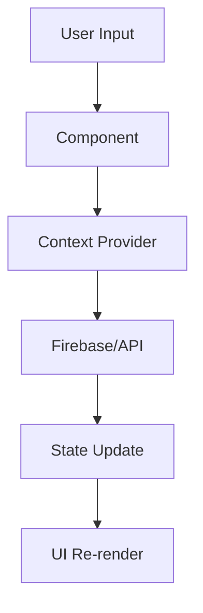

# 🏗️ نظرة عامة على البنية المعمارية

## 📋 المحتويات
- [نظرة عامة](#نظرة-عامة)
- [البنية التقنية](#البنية-التقنية)
- [طبقات النظام](#طبقات-النظام)
- [تدفق البيانات](#تدفق-البيانات)
- [الأمان](#الأمان)

## نظرة عامة

FlowCanvasAI مبني على **بنية معمارية متقدمة** تدعم:
- **التطوير المكون-المبني** (Component-Based Architecture)
- **إدارة الحالة المركزية** باستخدام React Context
- **نظام التصميم المتكامل** مع Tailwind V4
- **تكامل AI متقدم** مع Firebase و Gemini 2.0

## البنية التقنية

### 🎯 **التقنيات الأساسية**
```typescript
// Frontend Framework
- React 18 + TypeScript
- Tailwind CSS V4
- Framer Motion / Motion React
- Shadcn/ui Components

// Backend & AI
- Firebase (Authentication, Firestore, Functions)
- Google Gemini 2.0 Flash AI
- Serverless Architecture

// State Management
- React Context API
- localStorage للإعدادات
- IndexedDB للبيانات المحلية
```

### 🏢 **هيكل المجلدات**
```
src/
├── components/           # المكونات الأساسية
│   ├── ui/              # مكونات Shadcn
│   ├── features/        # مكونات الميزات
│   ├── layout/          # مكونات التخطيط
│   └── providers/       # مزودي السياق
├── lib/                 # المكتبات والأدوات
├── styles/              # ملفات الأنماط
└── pages/               # صفحات التطبيق
```

## طبقات النظام

### 🎨 **طبقة العرض (Presentation Layer)**
```typescript
// React Components
├── Header & Navigation
├── Page Components
├── Feature Components
└── UI Components
```

### 🧠 **طبقة المنطق (Logic Layer)**
```typescript
// Business Logic
├── AI Chat System
├── Workflow Builder Logic
├── Theme & Language Management
└── Form Validation
```

### 🔗 **طبقة البيانات (Data Layer)**
```typescript
// Data Management
├── Firebase Integration
├── Local Storage
├── State Management
└── API Calls
```

## تدفق البيانات

### 📊 **نمط تدفق البيانات**


### 🔄 **إدارة الحالة**
```typescript
// Context Providers
- ThemeProvider     → Dark/Light Mode
- LanguageProvider  → Arabic/English
- AIProvider        → Chat & Assistant State
```

## الأمان

### 🔐 **الأمان على مستوى التطبيق**
- **Firebase Rules**: تحكم في الوصول للبيانات
- **Type Safety**: TypeScript في كامل المشروع
- **Input Validation**: تنظيف البيانات المدخلة
- **HTTPS Only**: تشفير كامل للاتصالات

### 🛡️ **الحماية من الثغرات**
- **XSS Protection**: تنظيف HTML المدخل
- **CSRF Protection**: رموز الحماية
- **Rate Limiting**: تحديد معدل الطلبات
- **Error Boundaries**: التعامل مع الأخطاء

## مميزات البنية

### ⚡ **الأداء**
- **Code Splitting**: تقسيم الكود للتحميل السريع
- **Lazy Loading**: تحميل كسول للمكونات
- **Bundle Optimization**: تحسين حجم الحزمة
- **Caching Strategy**: استراتيجية التخزين المؤقت

### 🔧 **قابلية الصيانة**
- **Modular Design**: تصميم معياري
- **Clean Code**: كود نظيف وموثق
- **Testing Strategy**: استراتيجية اختبار شاملة
- **Documentation**: توثيق شامل

### 📱 **الاستجابة**
- **Mobile First**: تصميم يبدأ بالموبايل
- **Progressive Enhancement**: تحسين تدريجي
- **Touch Friendly**: دعم اللمس
- **Accessibility**: إمكانية الوصول

## الخلاصة

بنية FlowCanvasAI تضمن:
- ✅ **قابلية التوسع** للنمو المستقبلي
- ✅ **سهولة الصيانة** للفرق التطوير
- ✅ **الأداء العالي** للمستخدمين
- ✅ **الأمان** للبيانات الحساسة